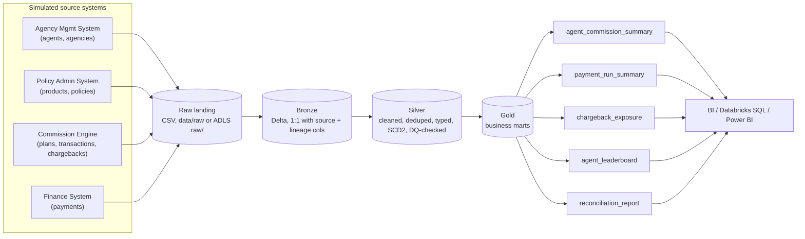
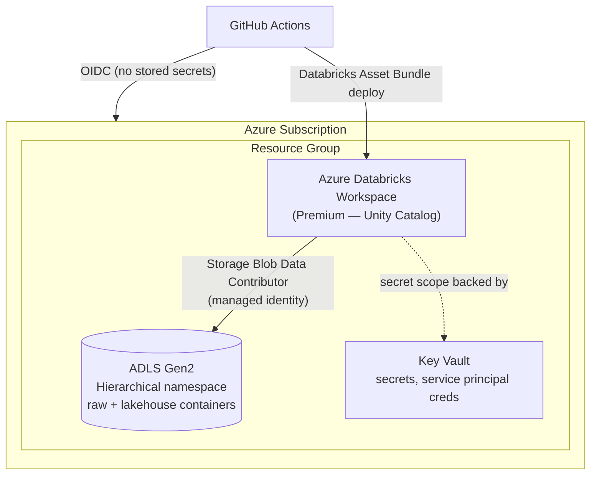
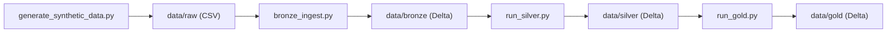

# Architecture

## Medallion pipeline

## Why medallion + Delta

- **Bronze is dumb on purpose.** No cleaning, no dedup — just raw source data landed with lineage columns (`_ingested_at`, `_source_file`). If a bug is found in a downstream transformation next month, Silver can be rebuilt from Bronze without re-pulling from source systems.
- **Silver is where trust is built.** Deduplication, type coercion, enum validation, and the SCD2 `dim_agent` all live here, gated by the data-quality framework in [`src/commissions_pipeline/dq`](../src/commissions_pipeline/dq). Rows that fail a hard check are quarantined to `silver/_quarantine/<table>` rather than silently dropped or silently "fixed."
- **Gold is business logic, not more cleaning.** Aggregations, the agent leaderboard, chargeback-risk scoring, and the finance reconciliation report all read only from Silver.
- **Delta Lake** gives ACID writes, time travel, and schema enforcement — the same format whether you're running this on a laptop, in Docker, or on Databricks with Unity Catalog.

## Cloud deployment target (Azure)

Infra is defined once in [`infra/terraform`](../infra/terraform) and deployed identically to dev/staging/prod by varying `-var-file`. The Databricks *jobs* (the actual bronze/silver/gold tasks and their schedule) are defined separately as a [Databricks Asset Bundle](../databricks.yml) — infra and workload are deployed independently, which is the standard split on a real data platform team.

## Local development

Same code, same Delta format, zero cloud dependency:

Setting `LAKEHOUSE_ROOT=abfss://lakehouse@<storage>.dfs.core.windows.net` (or a Unity Catalog volume path) points the exact same code at Azure — see [`config.py`](../src/commissions_pipeline/config.py).
