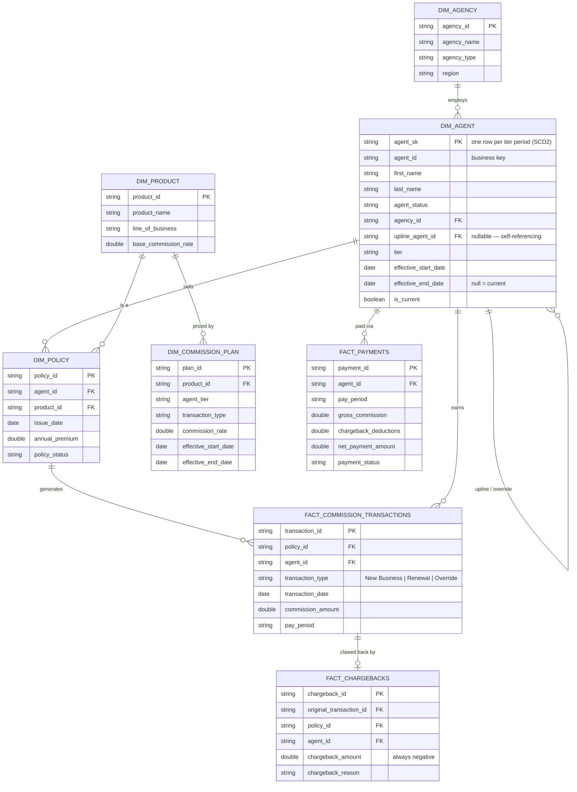

# Entity-Relationship Diagram

Logical model as it lands in Silver/Gold (Bronze mirrors this 1:1 plus lineage columns).

```mermaid
erDiagram
    DIM_AGENCY ||--o{ DIM_AGENT : employs
    DIM_AGENT ||--o{ DIM_AGENT : "upline / override"
    DIM_AGENT ||--o{ DIM_POLICY : sells
    DIM_PRODUCT ||--o{ DIM_POLICY : "is a"
    DIM_PRODUCT ||--o{ DIM_COMMISSION_PLAN : "priced by"
    DIM_POLICY ||--o{ FACT_COMMISSION_TRANSACTIONS : generates
    DIM_AGENT ||--o{ FACT_COMMISSION_TRANSACTIONS : earns
    FACT_COMMISSION_TRANSACTIONS ||--o| FACT_CHARGEBACKS : "clawed back by"
    DIM_AGENT ||--o{ FACT_PAYMENTS : "paid via"

    DIM_AGENCY {
        string agency_id PK
        string agency_name
        string agency_type
        string region
    }
    DIM_AGENT {
        string agent_sk PK "one row per tier period (SCD2)"
        string agent_id "business key"
        string first_name
        string last_name
        string agent_status
        string agency_id FK
        string upline_agent_id FK "nullable — self-referencing"
        string tier
        date effective_start_date
        date effective_end_date "null = current"
        boolean is_current
    }
    DIM_PRODUCT {
        string product_id PK
        string product_name
        string line_of_business
        double base_commission_rate
    }
    DIM_COMMISSION_PLAN {
        string plan_id PK
        string product_id FK
        string agent_tier
        string transaction_type
        double commission_rate
        date effective_start_date
        date effective_end_date
    }
    DIM_POLICY {
        string policy_id PK
        string agent_id FK
        string product_id FK
        date issue_date
        double annual_premium
        string policy_status
    }
    FACT_COMMISSION_TRANSACTIONS {
        string transaction_id PK
        string policy_id FK
        string agent_id FK
        string transaction_type "New Business | Renewal | Override"
        date transaction_date
        double commission_amount
        string pay_period
    }
    FACT_CHARGEBACKS {
        string chargeback_id PK
        string original_transaction_id FK
        string policy_id FK
        string agent_id FK
        double chargeback_amount "always negative"
        string chargeback_reason
    }
    FACT_PAYMENTS {
        string payment_id PK
        string agent_id FK
        string pay_period
        double gross_commission
        double chargeback_deductions
        double net_payment_amount
        string payment_status
    }
```
